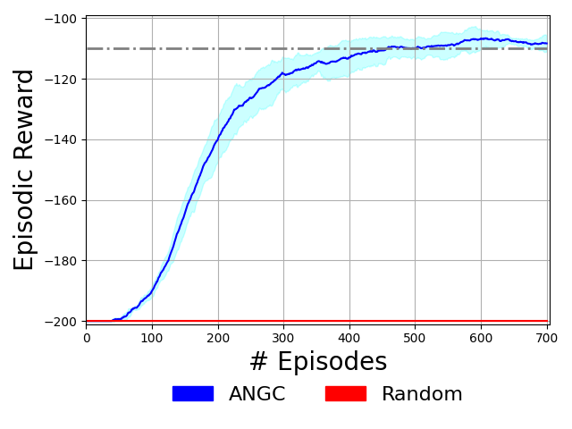
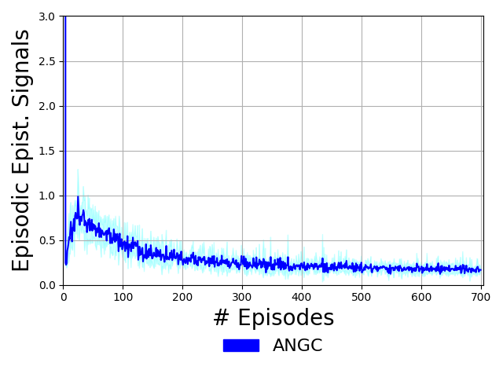
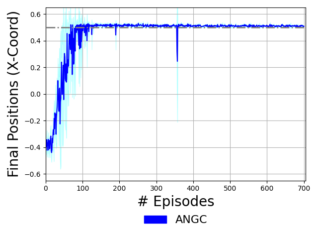

# <p align="center">Active Neural Generative Coding (ANGC)</p>
## <p align="center">Biologically-plausible, Backpropagation-free Learning for Active Inference Neural Agents</p>
Implementation of the proposed <a href="https://ojs.aaai.org/index.php/AAAI/article/view/19876">active neural generative coding (ANGC)   algorithm</a> for training a simple neurobiologically-plausible active-inference agent. This work instantiates a form of active inference
in terms of predictive coding (PC) circuitry, resulting in an agent that learns by dynamically evolving two PC neural circuits -- an actor/policy circuit and a world/transition model -- across a stream of episodes. Note that this agent is meant for tackling simple dense and sparse reward control problems. The instrumental term (or prior preference) in ANGC is treated to be the problem reward function (reflecting an assumption based on the complete class theorem) while the epistemic foraging term is produced by the agent's world model circuit. This
code specifically provides the mountain car experiments conducted.

# Requirements
Our implementation is easy to follow and, with knowledge of basic linear algebra, one can decode the inner workings of ANGC. Please consult
<a href="https://ojs.aaai.org/index.php/AAAI/article/view/19876"> for general details on mechanics and experiments conducted at the time.
In this framework, we have provided simple modules; thus hopefully making it very convenient to extend our framework.

To run the code, you should only need following basic packages:
1. Jax (version >= 0.4.18)
2. Numpy
3. Matplotlib
4. Python (version >=3.11.4)

# Execution

To generate mountain car results as per our paper, simply perform the following steps (running the relevant provided Bash scripts) the following provided Bash scripts:
1. `bash src/run_exp.sh` (This will train/adapt the ANGC agent over `E=700` episodes.)
2. `bash src/plot_exp_stats.sh` (This will produce visuals: a reward plot, an epistemic signal plot, and an agent position plot.)
After running the above two scripts, you can find the simulation outputs in the example
experimental results directory tree that have been pre-created for you.
`results/mcar/angc/` contains the numerical array results for the ANGC model (over 3 experimental trials)  while
`results/mcar/` will contain the plots.
In `results/mcar/`, the following is stored:
* `mcar_returns.png` - plot of episodic rewards (w/ mountain car solution threshold and random baseline lower bound)
* `mcar_epi_returns.png` - plot of episodic cumulative epistemic signals produced for ANGC trained on mountain car
* `mcar_xpos.png` - plot of ANGC agent car position (x-coordinate; for mountain car only)
In `results/mcar/angc/`, the following arrays are stored:
* `rewards0.npy`, `rewards1.npy`, `rewards2.npy` - episodic reward arrays for trials 0, 1, and 2
* `epi_rewards0.npy`, `epi_rewards1.npy`, `epi_rewards2.npy` - episodic reward arrays for trials 0, 1, and 2
* `x_position0.npy`, `x_position1.npy`, `x_position2.npy` - agent car positions for trials 0, 1, and 2
(Note that the bash scripts detect working directory you have checked out this code-base.)

Model-specific and training-specific hyper-parameter defaults can be set/adjusted in `src/train_agent.py`.
Note that if you just execute `bash src/plot_exp_stats.sh`, you will obtain plots based on the
pre-computed experimental values for trials 0, 1, and 2 directly. If you do so, you should obtain plots
roughly as follows:

With the provided experimental data, you should obtain the following episodic
reward/return plot (Left), episodic cumulative epistemic signal plot (Middle),
and the agent car position plot (Right):

<p float="middle">
  
  
  
</p>


Tips while using this algorithm/model on other environments/worlds:
1. Tinker with `gamma` (discount factor, values in range `[0.95,0.99]`) as well as
   with `batch_size`  `eta`.
2. Changing the architecture of the circuits (changing the number of neurons in each layer)
   can help as well. Currently, inside leaky relu is used for the NGC circuits, but this
   can be modified in the code to use other activation functions supported in JAX, so long
   as the derivative is coded in.

# Citation

If you use or adapt (portions of) this code/algorithm in any form in your project(s), or
find the ANGC agent algorithm helpful in your own work, please cite this code's source paper:

```bibtex
@inproceedings{ororbia2022backprop,
  title={Backprop-free reinforcement learning with active neural generative coding},
  author={Ororbia, Alexander G and Mali, Ankur},
  booktitle={Proceedings of the AAAI Conference on Artificial Intelligence},
  volume={36},
  pages={29--37},
  year={2022}
}
```
